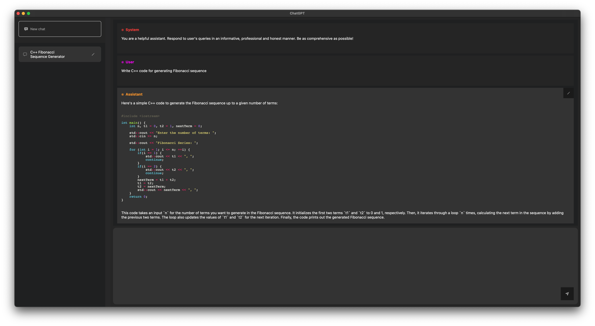

# ChatGPT - GPT-4 Integration for macOS

Welcome to the SwiftUI ChatGPT project for macOS! This native macOS application is built using the modern Swift programming language and the SwiftUI framework, providing a seamless and visually appealing interface for users to interact with GPT-4. Our goal is to create an engaging and intuitive chat experience, similar to ChatGPT, by leveraging the power of GPT-4's natural language processing capabilities.

## User Interface

The user interface is heavily inspired by OpenAI's ChatGPT interface:

You can perform any actions that you would expect, and more!

For example, our implementation of ChatGPT allows you to remove specific messages from the history or edit their content. This allows for more dynamic control over the chat history.

To delete a message, swipe left on the message cell:

To edit a message, simply tap on the message cell:

After editing, save your changes by tapping the checkmark:

You can also delete existing documents by swiping left on the document cell:

The title of the document is automatically generated using GPT; however, you can change the title if you wish:

### Syntax Highlighting

To enable syntax highlighting, install [Pygments](https://formulae.brew.sh/formula/pygments). There are still several improvements to be made regarding syntax highlighting, but the basic functionality works:

## Roadmap

- [ ] Streaming API integration
- [ ] Improved syntax highlighting

Our roadmap includes integrating the Streaming API for real-time communication and enhancing the syntax highlighting feature for a better user experience. Stay tuned for updates and improvements!
